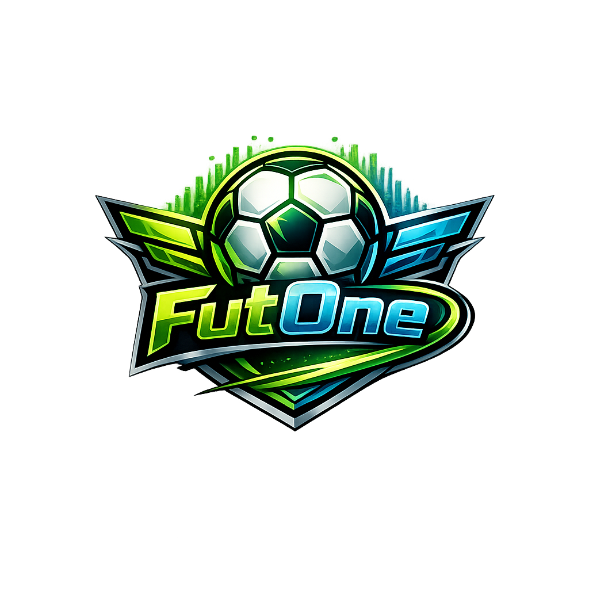

<p align="center">
	
</p>

# Futone

Futone e um jogo no estilo futmanager, focado em estrategia, gestao de elenco e competicoes online.

O principal diferencial e a criacao de ligas online com partidas multiplayer em tempo real, onde voce pode enfrentar outros jogadores humanos ou times controlados pelo computador.

## Visao Geral

- Estilo futmanager com foco em decisao tatica e administracao do clube.
- Criacao de ligas privadas e publicas para comunidades e amigos.
- Partidas em tempo real com multiplayer entre humanos.
- Modo hibrido com jogos contra IA (CPU) para manter a liga ativa.
- Plataforma web com interface responsiva para desktop e mobile.

## Funcionalidades Principais

- Autenticacao completa de usuarios (registro, login e perfil).
- Gestao de times, elencos e desempenho por competicao.
- Organizacao de calendario, confrontos e classificacao da liga.
- Simulacao e processamento de partidas em tempo real.
- Infraestrutura para partidas PvP (humano vs humano) e PvE (humano vs CPU).

## Stack Tecnologico

- Backend: Laravel 11.x
- Frontend: Blade Templates + Alpine.js
- Estilizacao: Tailwind CSS
- Banco de dados: SQLite (desenvolvimento)
- Testes: Pest Framework
- Build: Vite

## Como Rodar o Projeto

### Requisitos

- PHP 8.2+
- Composer
- Node.js 18+
- npm

### Instalacao

1. Clone o repositorio

```bash
git clone <seu-repositorio>
cd futone
```

2. Instale dependencias PHP

```bash
composer install
```

3. Configure o ambiente

```bash
cp .env.example .env
php artisan key:generate
```

4. Instale dependencias frontend

```bash
npm install
```

5. Rode migracoes

```bash
php artisan migrate
```

6. Inicie a aplicacao

```bash
npm run dev
php artisan serve
```

Aplicacao disponivel em: http://localhost:8000

## Testes

```bash
./vendor/bin/pest
```

## Build de Producao

```bash
npm run build
php artisan config:cache
php artisan route:cache
```

## Licenca

Este projeto esta sob a licenca MIT.
